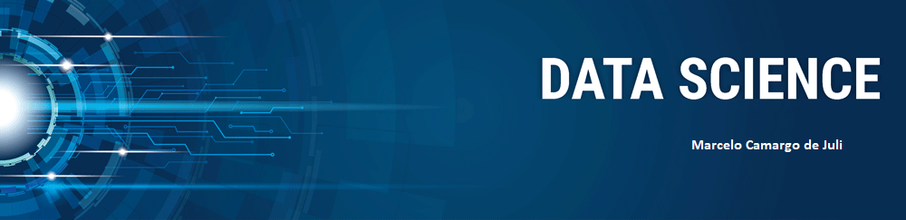

# Data-Science
Meu portifólio de projetos de data science
 
 

  

# Marcelo Camargo de Juli
*

Doutor em Física pela UFRGS, com stágio de pós-doutoramento IAG-USP. Participei do programa Jovem Pesquisador-FAPESP desenvolvido na Universidade Presbiteriana Mackenzie-CRAAM. Especialização em Computação aplicada à educação (ICMC-USP). Desenvolvimento de pesquisa teórica na área de Física de Plasmas.

**Background in:** Matemática, Física, WEKA, MAPLE.

**Links:**
* [Blog]()
* [LinkedIn]()
* [Medium]()

## Projetos:
Veja alguns projetos desenvolvidos:

* **Mineração de dados usando WEKA para tratar dados educacionais (learning analytics):** https://drive.google.com/open?id=1d_nxdYNyzl4-1dEbTYZHZMbCOBJa7las

---

